# stacks2d (tinyrealms)

A place to go.

Work in progress: a 2D social world and agent sandbox for creator economy and Stacks/Bitcoin-native interactions.

This project builds from the original [61cygni/tinyrealms](https://github.com/61cygni/tinyrealms) foundation, which provided a strong starting point for persistent 2D world simulation.

## At A Glance

- **What it is**: a 2D social world and customizable game foundation
- **What works now**: world rendering, map editing, multiplayer foundations, NPC runtime, Braintrust-backed AI actions
- **What it is becoming**: a sandbox for AI agents, creator economy, and Stacks/Bitcoin-native interactions
- **Why Stacks**: the architecture is being shaped for future AIBTC patterns, x402 on Stacks transaction flows, and external ecosystem adapters without coupling those concerns into the core game runtime

## Why This Matters

`stacks2d (tinyrealms)` is being developed as a practical bridge between:
- customizable 2D worldbuilding
- AI-enhanced NPC interaction
- modular agent infrastructure
- future Stacks-native economic and transaction patterns

The goal is not to overclaim finished blockchain integration.
The goal is to ship a strong game foundation now while cleanly preparing for:
- AIBTC-aligned agent tooling
- x402 on Stacks paid service flows
- creator economy mechanics
- ecosystem-driven identity, reputation, and opportunity ingestion

Internally, one of the clearest design framings is:

> Dungeons and Agents

Meaning:
- a sandbox for agents
- a world of roles, objects, value, and events
- a simulation surface that can later settle value through Stacks rails

## Architecture Snapshot

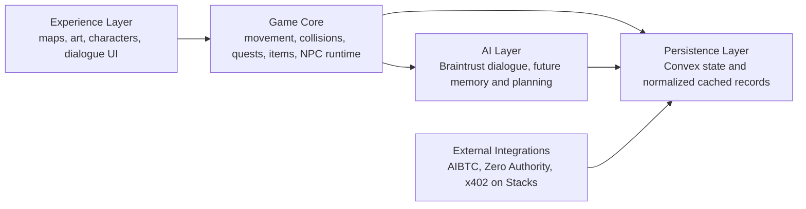

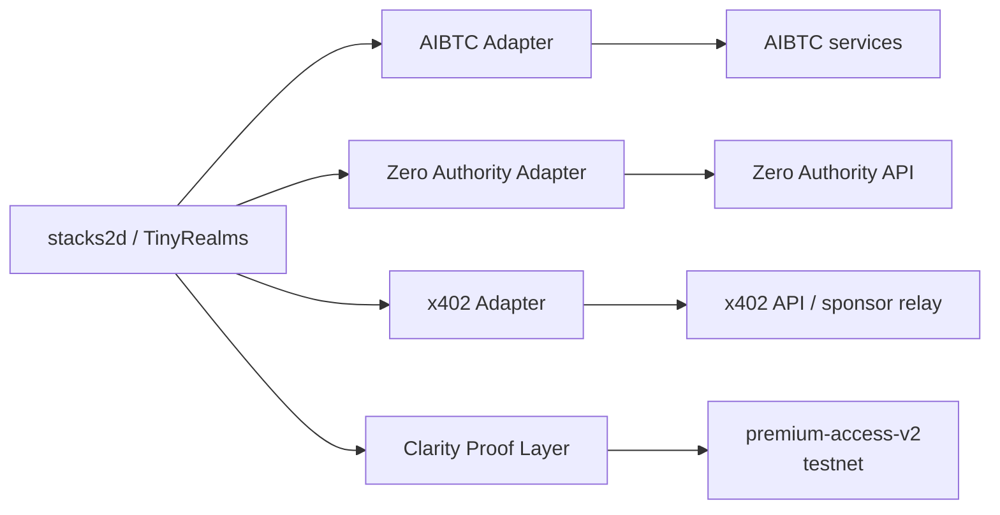

## Sequential Build Path

The project is being built in a strict order to avoid technical debt and fake claims.

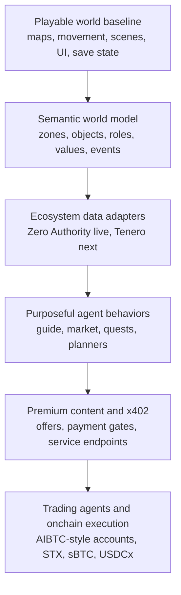

This order is intentional:
- do not put payment logic into rendering and movement
- do not call third-party APIs directly from the frontend
- do not claim onchain execution before payment or wallet paths are verified

## Live, Scaffolded, Planned

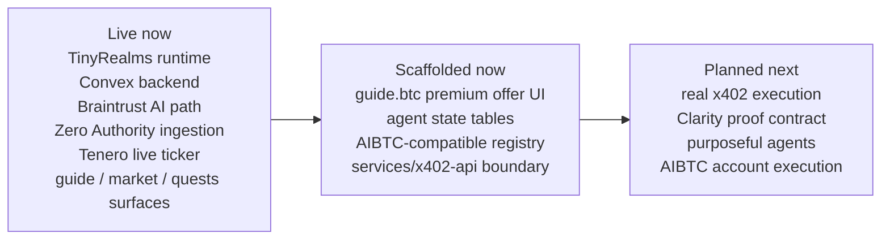

## Features

- **Shared 2D world** — multiplayer presence, map state, chat, and world data
- **Integrated map editor** — paint tiles, set collision, define zones, and save maps live to Convex
- **Sprite pipeline** — import sprite sheets, define animations, and render custom characters
- **NPC runtime** — server-authoritative NPC state with wandering, intent, and lightweight trading
- **AI narrative path** — Braintrust-backed dialogue and narrative generation
- **Economy primitives** — items, loot, shops, and in-world wallet records
- **Customizable foundation** — designed to support custom levels, custom characters, and future modular integrations

## Implementation Snapshot

Verified live in the current build:
- live Tenero ticker in the header
- Zero Authority opportunity cache used in-world
- dedicated surfaces for `guide.btc`, `market.btc`, and `quests.btc`
- `World Feed` driven by typed world events
- semantic world kernel and AIBTC-compatible registry in Convex
- premium offer metadata is real in Convex
- premium UI is real in the world

Verified locally:
- `services/x402-api` serves a real x402 v2 payment boundary for `guide.btc`
- the browser reads the `402 Payment Required` challenge
- a connected Stacks testnet wallet can sign the payment
- the signed retry settles through the service-local facilitator fallback
- `guide.btc` returns premium content after successful settlement
- the premium response is returned as structured JSON that can scale to both human UI rendering and agent consumption

Verified on Stacks testnet:
- `premium-access-v2` is deployed under Clarity 4
- deployed contract:
  - `ST2JDN3QED16X524SE8GWQSTP2MW6D2005AEEGJ9S.premium-access-v2`
- deployment tx:
  - `96afaf46c0e1ed8f86aceb0b0687fa6bdd284f9ea1366cd5437dc25901e969c3`

Scaffolded or still not yet verified beyond local development:
- hosted official facilitator path
- polished payment receipt / tx hash UX
- x402-to-contract grant flow
- future AIBTC account execution

## Verified Backend Connector Execution

The Stacks ecosystem connectors are backend-executed and cached before the world consumes them.

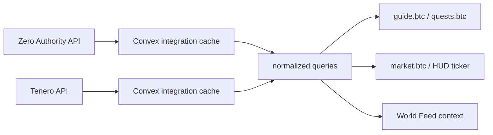

Verified connector paths in the current build:
- `Zero Authority API -> Convex cache -> guideSnapshot -> guide.btc and quests.btc`
- `Tenero API -> Convex cache -> tickerRows -> HUD ticker and market.btc`

Verified by runtime/backend queries:
- `integrations/zeroAuthority:guideSnapshot`
- `integrations/tenero:tickerRows`

## Current Status

This repository is intentionally presented as a **work in progress**.

What is working now:
- web client and Convex backend
- local development flow
- map loading and editing
- multiplayer presence foundations
- NPC runtime loop
- Braintrust-backed AI actions

What is planned next:
- deeper AI agent sandbox logic
- external ecosystem ingestion
- AIBTC-aligned agent tooling
- x402 on Stacks transaction flows
- future wallet integrations

## Future GameFi Layer

The longer-term contract roadmap includes a dedicated GameFi/SFT layer informed by the Stacks GameFi tutorial on SFT acquisition, crafting, level-up, and token metadata. Source: [SFTs: Flow and Smart Contracts](https://gamefi-stacks.gitbook.io/stacks-degens-gaming-universe/sfts-flow-and-smart-contracts)

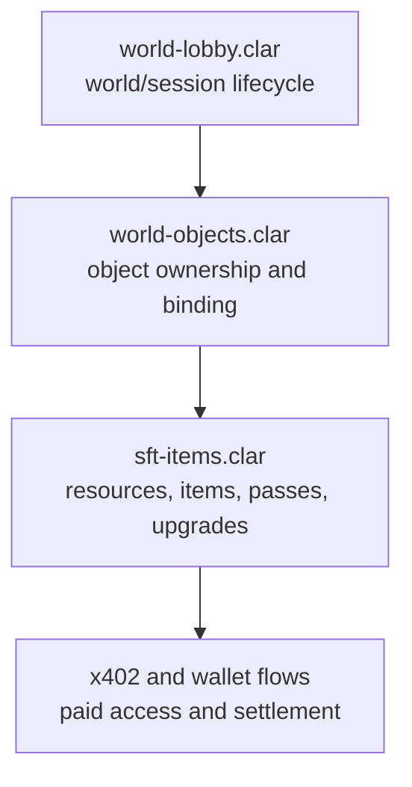

Planned uses for the SFT layer:
- room passes and access badges
- consumable resources
- craftable and upgradeable items
- creator/media access items
- future skins, tools, and world modules

Important truth:
- this SFT layer is a planned roadmap item
- it is not implemented in the current build

## Contract Proof Layer

The first contract proof layer is no longer theoretical.

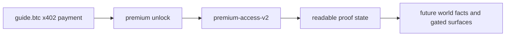

Current truth:
- `premium-access-v2` is deployed on Stacks testnet
- it is a post-payment proof/state contract, not the x402 settlement mechanism
- the backend is not yet calling `grant-access` after successful payment

## Why x402 and the Contract Both Exist

Judges should read the two layers like this:

- x402 answers: `can this premium action be paid for and unlocked right now?`
- `premium-access-v2` answers: `can this premium unlock be proven or recorded onchain after payment?`

In other words:

- x402 = payment and delivery
- Clarity = proof and durable world state

That separation is deliberate.
It keeps the payment rail narrow while giving the world a path to:
- gated rooms
- gated objects
- pass-based access
- future item and world logic

## Tech Stack

- **Frontend**: Vite + TypeScript
- **Rendering**: PixiJS v8
- **Backend**: Convex (database, real-time, file storage, auth)
- **AI**: Braintrust AI Proxy
- **Future Stacks direction**: AIBTC patterns, x402 on Stacks, and modular external adapters

## Service Boundaries

The project now includes a dedicated x402 service scaffold:

```text
services/
└── x402-api/        Separate payment-required HTTP surface for premium endpoints
```

Current truth:
- the service exists in the repo and runs locally
- the world-side offer metadata exists in Convex
- the in-world premium UI is real
- the first local `guide.btc` x402 payment path is verified end-to-end on Stacks testnet
- hosted/public facilitator behavior is still a separate verification item

## Premium Payload Contract

The x402 premium response is intentionally JSON-first.

Why that matters:

- humans can view it as a styled premium card in-world
- agents can consume it programmatically without prose parsing
- apps can treat it as a stable contract between payment, content, and world-state consequences

Current shape:

- payment/proof metadata
- premium classification
- delivery timestamp

Current limitation:

- the verified local payload is still closer to a receipt/proof envelope than a fully enriched classified briefing

Next evolution:

- keep the receipt/proof fields
- add richer structured briefing content sourced from backend integrations
- let that same JSON contract later scale into:
  - premium rooms via `world-lobby.clar`
  - premium terminals and objects via `world-objects.clar`
  - passes/items via `sft-items.clar`

## DoraHacks Snapshot

The strongest honest hackathon claim today is:

- playable 2D world shell with multiplayer foundations
- backend-driven Stacks ecosystem discovery surfaces
- purposeful named agents (`guide.btc`, `market.btc`, `quests.btc`)
- one verified local x402 payment proof through `guide.btc`
- one deployed Clarity 4 contract proof layer:
  - `premium-access-v2`
- AIBTC-aligned agent registry and account-binding scaffolding in Convex
- a clear contract roadmap:
  - `premium-access-v2`
  - `world-lobby.clar`
  - `world-objects.clar`
  - later `sft-items.clar`

Still roadmap, not live:

- broader multi-agent economic execution
- autonomous trading / basket strategy
- broad Chainhooks rollout
- item/SFT economy
- hosted production payment infrastructure

See also:
- [docs/Stacks2D-Architecture.md](./docs/Stacks2D-Architecture.md)
- [docs/Current-State-2026-03-14.md](./docs/Current-State-2026-03-14.md)
- [docs/SFT-GameFi-Context.md](./docs/SFT-GameFi-Context.md)

## Getting Started

### Prerequisites

- Node.js 18+
- A [Convex](https://convex.dev) account for cloud workflows, or local Convex for offline/local development
- Optionally, a [Braintrust](https://braintrust.dev) API key (for NPC AI)

### Setup

1. Install dependencies:
   ```bash
   npm install
   ```

2. Initialize Convex:
   ```bash
   npx convex dev --local
   ```
   This starts a local Convex deployment and generates the `_generated` types.

3. Set up environment variables:
   - Copy `.env.local.example` to `.env.local` and fill in `VITE_CONVEX_URL`
   - In Convex, set these environment variables as needed:
     - `JWT_PRIVATE_KEY` — local auth signing key
     - `JWKS` — local auth verification key set
     - `ADMIN_API_KEY` — local admin helper key
     - `BRAINTRUST_API_KEY` — optional AI key
     - `BRAINTRUST_MODEL` — optional model override

4. Run the dev server:
   ```bash
   npm run dev
   ```
   This starts both the Vite frontend and the Convex backend in parallel.

## Project Structure

```
convex/               Convex backend
├── schema.ts         Database schema (all tables)
├── auth.ts           Auth configuration
├── maps.ts           Map CRUD
├── players.ts        Player persistence
├── presence.ts       Real-time position sync
├── npcEngine.ts      Server-authoritative NPC runtime loop
├── npcProfiles.ts    NPC profile records and metadata
├── story/            Narrative backend
│   ├── quests.ts
│   ├── dialogue.ts
│   ├── events.ts
│   └── storyAi.ts    Braintrust LLM actions
├── agents/           Planned agent sandbox modules
├── integrations/     Planned external adapters (AIBTC, Zero Authority, x402)
└── mechanics/        Game mechanics backend
    ├── items.ts
    ├── inventory.ts
    ├── combat.ts
    ├── economy.ts
    └── loot.ts

src/                  Frontend
├── engine/           PixiJS game engine
│   ├── Game.ts       Main loop
│   ├── Camera.ts     Viewport
│   ├── MapRenderer.ts
│   ├── EntityLayer.ts
│   └── InputManager.ts
├── lib/              Shared client helpers
├── splash/           Overlay / splash screen system
└── ui/               HUD, chat, auth, profile, and mode controls
```

## Architecture Direction

The product is being built with clear boundaries:

- **Experience layer** — maps, characters, scenes, dialogue presentation
- **Game core** — movement, collisions, items, quests, NPC runtime state
- **AI layer** — Braintrust-backed dialogue and future agent memory / planning
- **Integration layer** — future AIBTC, Zero Authority, and x402 on Stacks adapters

This separation is intentional so the worldbuilding and asset pipeline can evolve without coupling the game client directly to external wallet or payment infrastructure.

See [docs/Stacks2D-Architecture.md](docs/Stacks2D-Architecture.md) for diagrams and module boundaries.

### Agent Framework Direction

The long-term agent architecture is layered rather than monolithic.

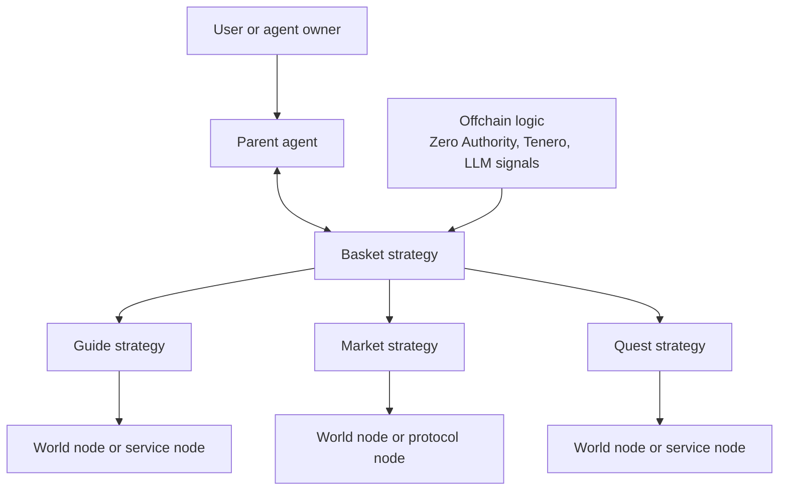

In `stacks2d`, that means:
- the world stays the interface layer
- strategy agents stay modular
- protocol and payment execution stay behind explicit nodes
- offchain signals help orchestrate decisions without taking over the engine

### World Semantics Direction

The world is being upgraded from a painted scene to a semantic simulation.

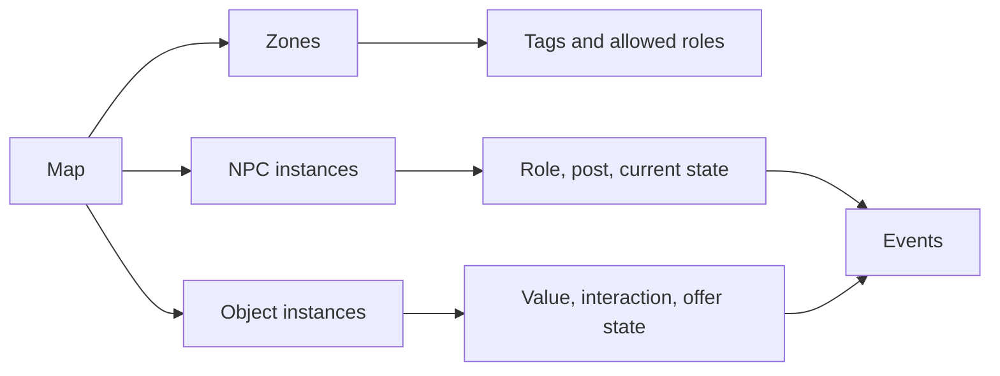

This is the basis for:
- purposeful NPC movement instead of random drift
- object-aware agents
- creator economy loops
- future multi-world sandbox behavior

### Spatial Intelligence Direction

Spatial intelligence in `stacks2d` is not just “more AI chat”.

It is a layered system:

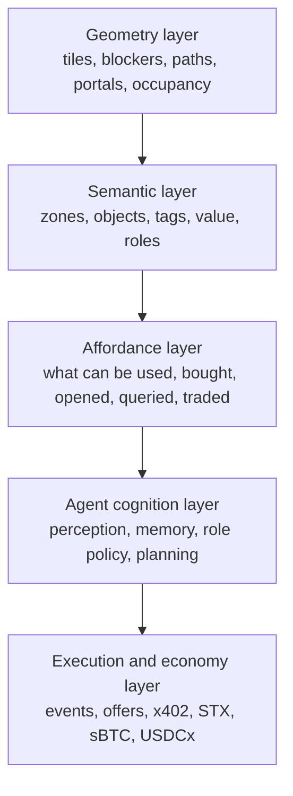

This means:
- geometry tells the system where things are
- semantics tells the system what things mean
- affordances tell agents what they can do
- cognition helps agents choose meaningful actions
- execution handles the resulting world or economic action

This is the path from:
- random NPC wandering
to
- a world where agents understand places, objects, and value

### System Diagram


### Module Boundaries

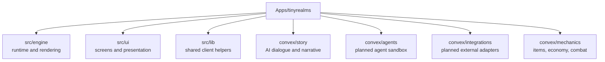

### Stacks Integration Direction

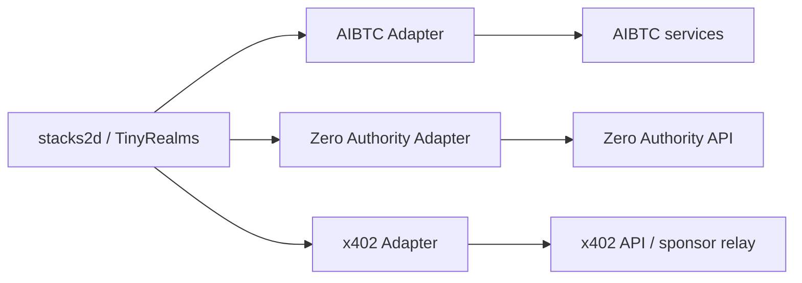

### Payment and Execution Direction

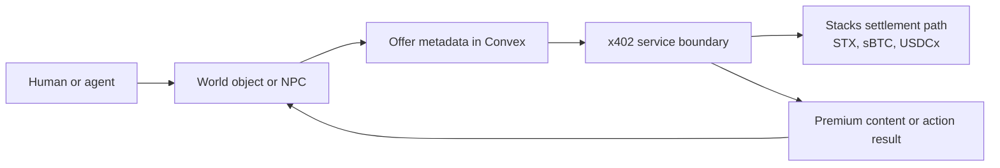

Today:
- offer metadata is real
- premium UI is real
- payment execution is not live yet

That distinction is deliberate and should be preserved in public grant language.

### Why Semantics Matter

Without semantics, a room is just background art.

With semantics, the system can know:
- a coffee mug is a consumable object
- a swap terminal is a finance object
- a billboard is a media object
- a guide desk is a social and information zone
- a premium booth can expose an x402 offer

That is what makes:
- ai-town style behavior
- creator economy objects
- autonomous agents
- future trading agents
possible inside the same world model

## Modes

- **Play** — explore the world and interact with characters
- **Build** — edit the map, collision, and placement data
- **Sprites** — define and preview custom sprite animations

## Attribution

This repository builds on the TinyRealms foundation while taking the product in a different direction around semantic worlds, AI agent simulation, and Stacks/Bitcoin-native economic primitives.
