# stacks2d (Dungeons & Agents)

> Dungeons and Agents

Meaning
• sandbox for agents
• world of roles, objects, value, and events
• simulation surface that can settle value through Bitcoin / Stacks rails

This is a playable Stacks-native GameFi sandbox where wallet-backed actors, paid actions (x402), and world state interact inside a multi-agent social simulation.

The project builds on the 61cygni/tinyrealms 2D engine, providing a strong foundation for persistent world simulation.

`Stackshub` is used here as a working name for a community-driven idea bank of modular dApps, not as final product branding.

## At A Glance

- **What it is**: a playable Stacks-native agent sandbox.
- **World shell**: 2D map, NPC, object, and exploration layer.
- **State layer**: Convex stores agents, offers, world facts, events, zones, and semantic objects.
- **AI layer**: Braintrust proxy-backed LLM calls use code-defined prompts for in-world dialogue, premium responses, and autonomous agent thoughts.
- **Payment rail**: x402 gates paid actions like premium briefings and live market quotes.
- **Contract layer**: Clarity contracts record premium access, room access, object access, collectible artifacts, and the next economy layer on Stacks testnet.
- **Agent direction**: AIBTC informs the wallet-backed agent pattern and the `market.btc` implementation lineage.

Start here for the clean reading order:
- [docs/00-Start-Here.md](/home/rv404/RV404-Lab/PRODUCTIVITY/Obsidian/Test-1a/Apps/tinyrealms/docs/00-Start-Here.md)

Submission pack:
- [submission/README.md](/home/rv404/RV404-Lab/PRODUCTIVITY/Obsidian/Test-1a/Apps/tinyrealms/submission/README.md)
- [submission/submission.json](/home/rv404/RV404-Lab/PRODUCTIVITY/Obsidian/Test-1a/Apps/tinyrealms/submission/submission.json)

## Current Demo

The current demo focuses on:

- one in-world premium interaction
- STX payment on Stacks testnet
- visible payment and proof steps
- object-triggered and agent-triggered interactions

## Live Contract Stack

- `premium-access-v2`
  - premium access proof on Stacks testnet
- `world-lobby`
  - room and access state on Stacks testnet
- `world-objects`
  - object registration, activity, and access state on Stacks testnet
- `floppy-disk-nft-v2`
  - SIP-009 media artifact
- `cassette-nft-v2`
  - SIP-009 media artifact
- `wax-cylinder-nft-v2`
  - SIP-009 flagship media artifact
- `qtc-token`
  - SIP-010 fungible token for the future in-world economy layer
- `sft-items`
  - semi-fungible item layer for repeatable resources and access items

## Verified Links

- `premium-access-v2` contract:
  - Records paid premium-access proof on Stacks testnet.
  - `ST2JDN3QED16X524SE8GWQSTP2MW6D2005AEEGJ9S.premium-access-v2`
  - https://explorer.hiro.so/txid/0x96afaf46c0e1ed8f86aceb0b0687fa6bdd284f9ea1366cd5437dc25901e969c3?chain=testnet
- `world-lobby` contract:
  - Records room creation, open or closed state, and room access on Stacks testnet.
  - `ST2JDN3QED16X524SE8GWQSTP2MW6D2005AEEGJ9S.world-lobby`
  - https://explorer.hiro.so/txid/e411bff9d554b55f12a19c30fa4d278525f8c197f4deac3391cb4362b0e6d84f?chain=testnet
- `world-objects` contract:
  - Records object registration, active state, and object access on Stacks testnet.
  - `ST2JDN3QED16X524SE8GWQSTP2MW6D2005AEEGJ9S.world-objects`
  - https://explorer.hiro.so/txid/37518e87cdb28578cdc9c8afcd5ba42245fca3c45d2adda4b4dfbd0bea5d385f?chain=testnet
- `floppy-disk-nft-v2` contract:
  - Current SIP-009 media artifact deployment on Stacks testnet.
  - `ST2JDN3QED16X524SE8GWQSTP2MW6D2005AEEGJ9S.floppy-disk-nft-v2`
  - https://explorer.hiro.so/txid/0xcca2941d4894f25b2ac1f68a0aa20b078237587d4406a751e48a167c1ecb6956?chain=testnet
- `cassette-nft-v2` contract:
  - Current SIP-009 media artifact deployment on Stacks testnet.
  - `ST2JDN3QED16X524SE8GWQSTP2MW6D2005AEEGJ9S.cassette-nft-v2`
  - https://explorer.hiro.so/txid/0x589305b8353192df54c642a6f408a53c488367a4057114661e0b90d6f5db403d?chain=testnet
- `wax-cylinder-nft-v2` contract:
  - Current SIP-009 flagship artifact deployment on Stacks testnet.
  - `ST2JDN3QED16X524SE8GWQSTP2MW6D2005AEEGJ9S.wax-cylinder-nft-v2`
  - https://explorer.hiro.so/txid/0x25a39a2005a51765c6a540436fd8b6efadc2191360347ad432af90364217ce74?chain=testnet
- `qtc-token` contract:
  - SIP-010 fungible token deployed on Stacks testnet.
  - `ST2JDN3QED16X524SE8GWQSTP2MW6D2005AEEGJ9S.qtc-token`
  - https://explorer.hiro.so/txid/0x2a0ccf9cb5c22fcd16a0d8ff897c5fadf231cd41bf77558d49bd8f7d8ca032de?chain=testnet
- `sft-items` contract:
  - custom semi-fungible item layer deployed on Stacks testnet.
  - `ST2JDN3QED16X524SE8GWQSTP2MW6D2005AEEGJ9S.sft-items`
  - https://explorer.hiro.so/txid/0xae0b7cb5b01fbd84acb5db5cf4501d9a49dcc06af4b73a1f664d583ca4952944?chain=testnet

## What Is Verified

- `guide.btc`: a testnet x402 premium payment loop returns paid content after wallet-signed settlement.
- `market.btc`: a testnet x402 paid quote loop returns a live quote payload after wallet-signed settlement.
- `premium-access-v2`: a deployed Clarity 4 contract records paid premium-access proof on testnet.
- `world-lobby`: a deployed Clarity contract records room creation, room access, and room entry state on testnet.
- `world-objects`: a deployed Clarity contract records object registration, object access, and object activity state on testnet.
- `floppy-disk-nft-v2`, `cassette-nft-v2`, `wax-cylinder-nft-v2`: deployed SIP-009 media artifacts on testnet.
- `qtc-token`: deployed SIP-010 fungible token on testnet, not yet integrated into gameplay.
- `sft-items`: deployed semi-fungible item contract on testnet, not yet integrated into gameplay.
- `Zero Authority`: backend-ingested ecosystem data is cached in Convex and rendered in-world.
- `Tenero`: backend-ingested market data is cached in Convex and rendered in the HUD and `market.btc`.

## Why This Matters

`stacks2d` is being developed as a practical bridge between:
- customizable 2D worldbuilding
- AI-enhanced NPC interaction
- modular agent infrastructure
- future Stacks-native economic and transaction patterns

The goal is not to overclaim finished blockchain integration.
The goal is to ship a strong game foundation now while cleanly preparing for:
- AIBTC-aligned agent tooling
- x402 on Stacks paid service flows
- creator economy mechanics
- ecosystem-driven identity, reputation, and opportunity ingestion
- lightweight gossip through world events


## Architecture Snapshot

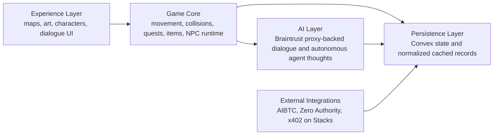

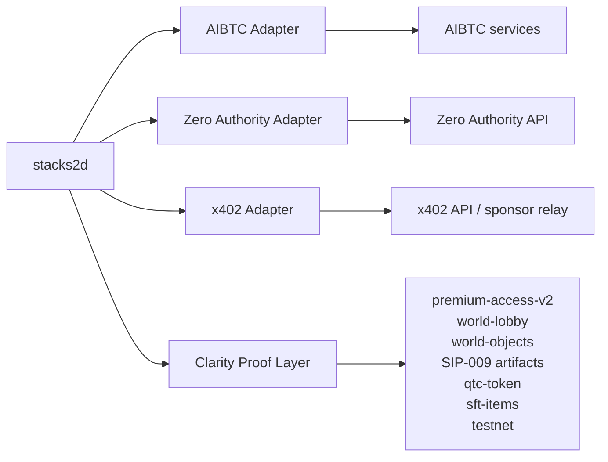

## Sequential Build Path

The platform architecture follows a deliberate order:

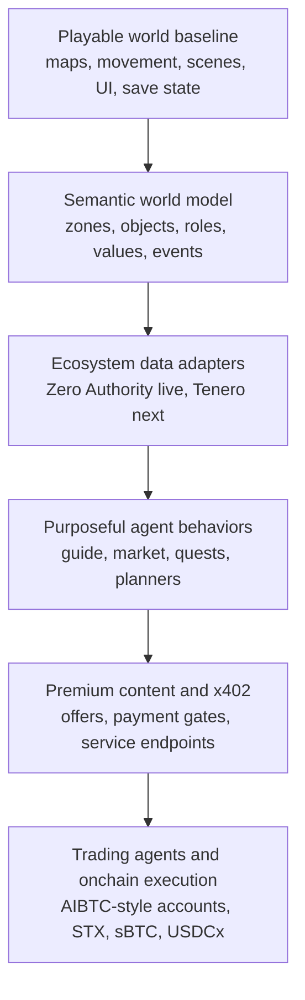

This order is intentional:
- do not put payment logic into rendering and movement
- do not call third-party APIs directly from the frontend
- do not claim onchain execution before payment or wallet paths are verified

## Live, Scaffolded, Planned

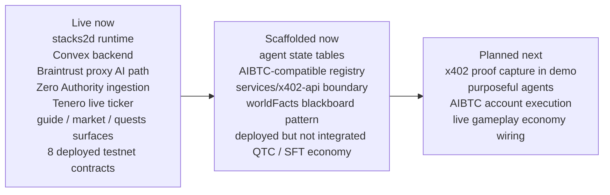

## Features

- **Shared 2D world** — multiplayer presence, map state, chat, and world data
- **Integrated map editor** — paint tiles, set collision, define zones, and save maps live to Convex
- **Sprite pipeline** — import sprite sheets, define animations, and render custom characters
- **NPC runtime** — server-authoritative NPC state with wandering, intent, and lightweight trading
- **AI narrative path** — Braintrust proxy-backed dialogue generation and autonomous agent thought loops
- **Economy primitives** — items, loot, shops, and in-world wallet records
- **Customizable foundation** — designed to support custom levels, custom characters, and future modular integrations

## Implementation Snapshot

Verified live in the current build:
- live Tenero ticker in the header
- Zero Authority opportunity cache used in-world
- dedicated surfaces for `guide.btc`, `market.btc`, and `quests.btc`
- `World Feed` driven by typed world events
- semantic world kernel and AIBTC-compatible registry in Convex
- premium offer metadata is real in Convex
- premium UI is real in the world

Verified locally:
- `services/x402-api` serves a real x402 v2 payment boundary for `guide.btc`
- the browser reads the `402 Payment Required` challenge
- a connected Stacks testnet wallet can sign the payment
- the signed retry settles through the service-local facilitator fallback
- `guide.btc` returns premium content after successful settlement
- `market.btc` now has a verified testnet paid quote loop returning a real quote payload after x402 payment
- the premium response is returned as structured JSON that can scale to both human UI rendering and agent consumption

Verified on Stacks testnet:
- `premium-access-v2` is deployed under Clarity 4
- deployed contract:
  - `ST2JDN3QED16X524SE8GWQSTP2MW6D2005AEEGJ9S.premium-access-v2`
- deployment tx:
  - `96afaf46c0e1ed8f86aceb0b0687fa6bdd284f9ea1366cd5437dc25901e969c3`
- `world-lobby` is deployed on testnet
  - `ST2JDN3QED16X524SE8GWQSTP2MW6D2005AEEGJ9S.world-lobby`
  - `e411bff9d554b55f12a19c30fa4d278525f8c197f4deac3391cb4362b0e6d84f`
- `world-objects` is deployed on testnet
  - `ST2JDN3QED16X524SE8GWQSTP2MW6D2005AEEGJ9S.world-objects`
  - `37518e87cdb28578cdc9c8afcd5ba42245fca3c45d2adda4b4dfbd0bea5d385f`
- `floppy-disk-nft-v2` is deployed on testnet
  - `ST2JDN3QED16X524SE8GWQSTP2MW6D2005AEEGJ9S.floppy-disk-nft-v2`
  - `cca2941d4894f25b2ac1f68a0aa20b078237587d4406a751e48a167c1ecb6956`
- `cassette-nft-v2` is deployed on testnet
  - `ST2JDN3QED16X524SE8GWQSTP2MW6D2005AEEGJ9S.cassette-nft-v2`
  - `589305b8353192df54c642a6f408a53c488367a4057114661e0b90d6f5db403d`
- `wax-cylinder-nft-v2` is deployed on testnet
  - `ST2JDN3QED16X524SE8GWQSTP2MW6D2005AEEGJ9S.wax-cylinder-nft-v2`
  - `25a39a2005a51765c6a540436fd8b6efadc2191360347ad432af90364217ce74`
- `qtc-token` is deployed on testnet
  - `ST2JDN3QED16X524SE8GWQSTP2MW6D2005AEEGJ9S.qtc-token`
  - `2a0ccf9cb5c22fcd16a0d8ff897c5fadf231cd41bf77558d49bd8f7d8ca032de`
- `sft-items` is deployed on testnet
  - `ST2JDN3QED16X524SE8GWQSTP2MW6D2005AEEGJ9S.sft-items`
  - `ae0b7cb5b01fbd84acb5db5cf4501d9a49dcc06af4b73a1f664d583ca4952944`

Not yet fully integrated:
- public hosted payment infrastructure outside the local fallback path
- a clean receipt and transaction-proof user experience
- live grant-access verification across all premium paths with a configured deployer key
- live AIBTC-style agent account execution

## Verified Backend Connector Execution

The Stacks ecosystem connectors are backend-executed and cached before the world consumes them.

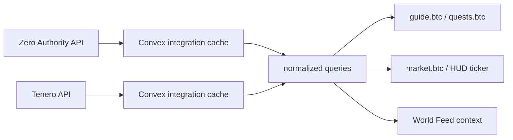

Verified connector paths in the current build:
- `Zero Authority API -> Convex cache -> guideSnapshot -> guide.btc and quests.btc`
- `Tenero API -> Convex cache -> tickerRows -> HUD ticker and market.btc`

Verified by runtime/backend queries:
- `integrations/zeroAuthority:guideSnapshot`
- `integrations/tenero:tickerRows`

## Lightweight Gossip Through World Events

The current world already has a typed `World Feed`.

The intended next step is to use that same event system as a lightweight gossip layer:
- a premium unlock creates a world event
- an agent action creates a world event
- a new opportunity or market shift creates a world event
- nearby or role-relevant world surfaces can react to those events

This is the current application-level version of social propagation:
- not a full distributed gossip protocol
- but a real world-memory mechanism that makes payments, offers, and agent actions visible inside the simulation

## Current Status

This repository is intentionally presented as a **work in progress**.

What is working now:
- web client and Convex backend
- local development flow
- map loading and editing
- multiplayer presence foundations
- NPC runtime loop
- Braintrust proxy-backed AI actions

What is planned next:
- deeper AI agent sandbox logic
- external ecosystem ingestion
- x402-to-contract writes
- stronger in-world agent dialogue and worldFacts coordination
- future wallet integrations

## Deployed GameFi Layer

The longer-term contract roadmap includes a dedicated GameFi/SFT layer informed by the Stacks GameFi tutorial on SFT acquisition, crafting, level-up, and token metadata. Source: [SFTs: Flow and Smart Contracts](https://gamefi-stacks.gitbook.io/stacks-degens-gaming-universe/sfts-flow-and-smart-contracts)

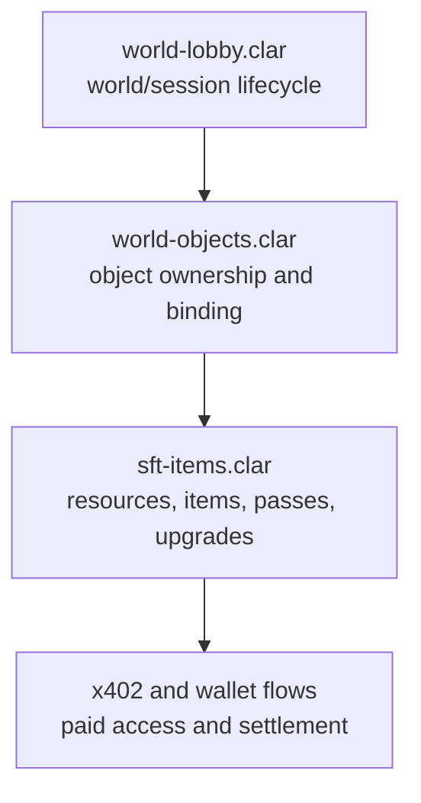

Planned uses for the SFT layer:
- room passes and access badges
- consumable resources
- craftable and upgradeable items
- creator/media access items
- future skins, tools, and world modules

Important truth:
- `qtc-token` and `sft-items` are now deployed on testnet
- they are not yet wired into a live gameplay loop
- the demo should still use STX as the active currency until gameplay mint/spend flows are visible

## Contract Proof Layer

The first contract proof layer is no longer theoretical.

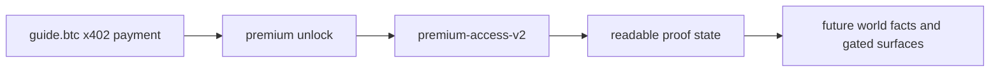

Current truth:
- `premium-access-v2` is deployed on Stacks testnet
- it is a post-payment proof/state contract, not the x402 settlement mechanism
- the service-side `grant-access` path is now wired, and live tx capture is the remaining verification step

## Why x402 and the Contract Both Exist

- x402 answers: `can this premium action be paid for and unlocked right now?`
- `premium-access-v2` answers: `can this premium unlock be proven or recorded onchain after payment?`

In other words:

- x402 = payment and delivery
- Clarity = proof and durable world state

That separation is deliberate.
It keeps the payment rail narrow while giving the world a path to:
- gated rooms
- gated objects
- pass-based access
- future item and world logic

## What The Contract Actually Does

`premium-access-v2` is a narrow onchain access-proof contract.

It lets the contract owner:

- grant access to a specific resource/media/asset for a specific principal
- revoke that access
- check whether a principal has access
- read the stored grant record

The contract stores:

- `resource-id`
- `who`
- `granted-at`
- `granted-by`

In plain English, it answers:

- `did this wallet get access to this premium thing?`
- `when was that access granted?`
- `who granted it?`

It does **not**:

- process payment itself
- replace x402
- mint items or tokens
- handle world/lobby/object logic yet

Its job is simple:

- durable onchain proof of premium unlock state after payment

## Current and Future Use Cases

Current MVP use case:

- `guide.btc` premium briefing
  - resource key: `guide-btc-premium-brief`
  - after successful x402 payment, the backend can record that unlock onchain

Near-future use cases:

- premium reports and classified ecosystem briefings
- premium rooms and gated spaces through `world-lobby.clar`
- premium terminals, boards, desks, and world objects through `world-objects.clar`
- passes, keys, badges, and itemized access through `sft-items.clar`
- agent-readable access checks for future wallet-bearing agents
- durable proof beyond session-only frontend or Convex state
- future fungible economy flows through `qtc-token.clar`

## Tech Stack

- **Frontend**: Vite + TypeScript
- **Rendering**: PixiJS v8
- **Backend**: Convex (database, real-time, file storage, auth)
- **AI**: Braintrust AI Proxy
- **Future Stacks direction**: AIBTC patterns, x402 on Stacks, and modular external adapters

## Service Boundaries

The project now includes a dedicated x402 service scaffold:

```text
services/
└── x402-api/        Separate payment-required HTTP surface for premium endpoints
```

Current truth:
- the service exists in the repo and runs locally
- the world-side offer metadata exists in Convex
- the in-world premium UI is real
- the first local `guide.btc` x402 payment path is verified end-to-end on Stacks testnet
- hosted/public facilitator behavior is still a separate verification item

## Premium Payload Contract

The x402 premium response is intentionally JSON-first.

Why that matters:

- humans can view it as a styled premium card in-world
- agents can consume it programmatically without prose parsing
- apps can treat it as a stable contract between payment, content, and world-state consequences

Current shape:

- payment/proof metadata
- premium classification
- delivery timestamp

Current limitation:

- the verified local payload is still closer to a receipt/proof envelope than a fully enriched classified briefing

Next evolution:

- keep the receipt/proof fields
- add richer structured briefing content sourced from backend integrations
- let that same JSON contract later scale into:
  - premium rooms via `world-lobby.clar`
  - premium terminals and objects via `world-objects.clar`
  - passes/items via `sft-items.clar`

- playable 2D world shell with multiplayer foundations
- backend-driven Stacks ecosystem discovery surfaces
- purposeful named agents (`guide.btc`, `market.btc`, `quests.btc`, `Mel`, `Toma`)
- verified x402 premium payment paths for `guide.btc` and `market.btc`
- eight deployed testnet contracts:
  - `premium-access-v2`
  - `world-lobby`
  - `world-objects`
  - `floppy-disk-nft-v2`
  - `cassette-nft-v2`
  - `wax-cylinder-nft-v2`
  - `qtc-token`
  - `sft-items`
- AIBTC-aligned agent registry and account-binding scaffolding in Convex

Still not live in gameplay:

- broader multi-agent economic execution
- autonomous trading and coordinator-driven execution
- broad Chainhooks rollout
- QTC mint/spend gameplay loop
- item/SFT gameplay economy
- hosted production payment infrastructure

See also:
- [docs/Overview.md](./docs/Overview.md)
- [docs/Backend-Contract.md](./docs/Backend-Contract.md)
- [docs/Stacks-Implementation-Status.md](./docs/Stacks-Implementation-Status.md)

## Getting Started

### Prerequisites

- Node.js 18+
- A [Convex](https://convex.dev) account for cloud workflows, or local Convex for offline/local development
- Optionally, a [Braintrust](https://braintrust.dev) API key (for NPC AI)

### Setup

1. Install dependencies:
   ```bash
   npm install
   ```

2. Initialize Convex:
   ```bash
   npx convex dev --local
   ```
   This starts a local Convex deployment and generates the `_generated` types.

3. Set up environment variables:
   - Copy `.env.local.example` to `.env.local` and fill in `VITE_CONVEX_URL`
   - In Convex, set these environment variables as needed:
     - `JWT_PRIVATE_KEY` — local auth signing key
     - `JWKS` — local auth verification key set
     - `ADMIN_API_KEY` — local admin helper key
     - `BRAINTRUST_API_KEY` — optional AI key
     - `BRAINTRUST_MODEL` — optional model override

4. Run the dev server:
   ```bash
   npm run dev
   ```
   This starts both the Vite frontend and the Convex backend in parallel.

## Project Structure

```
convex/               Convex backend
├── schema.ts         Database schema (all tables)
├── auth.ts           Auth configuration
├── maps.ts           Map CRUD
├── players.ts        Player persistence
├── presence.ts       Real-time position sync
├── npcEngine.ts      Server-authoritative NPC runtime loop
├── npcProfiles.ts    NPC profile records and metadata
├── story/            Narrative backend
│   ├── quests.ts
│   ├── dialogue.ts
│   ├── events.ts
│   └── storyAi.ts    Braintrust LLM actions
├── agents/           Planned agent sandbox modules
├── integrations/     Planned external adapters (AIBTC, Zero Authority, x402)
└── mechanics/        Game mechanics backend
    ├── items.ts
    ├── inventory.ts
    ├── combat.ts
    ├── economy.ts
    └── loot.ts

src/                  Frontend
├── engine/           PixiJS game engine
│   ├── Game.ts       Main loop
│   ├── Camera.ts     Viewport
│   ├── MapRenderer.ts
│   ├── EntityLayer.ts
│   └── InputManager.ts
├── lib/              Shared client helpers
├── splash/           Overlay / splash screen system
└── ui/               HUD, chat, auth, profile, and mode controls
```

## Architecture Direction

The product is being built with clear boundaries:

- **Experience layer** — maps, characters, scenes, dialogue presentation
- **Game core** — movement, collisions, items, quests, NPC runtime state
- **AI layer** — Braintrust proxy-backed dialogue, role prompts, and autonomous agent memory/planning
- **Integration layer** — future AIBTC, Zero Authority, and x402 on Stacks adapters

This separation is intentional so the worldbuilding and asset pipeline can evolve without coupling the game client directly to external wallet or payment infrastructure.

See [docs/Overview.md](docs/Overview.md) for the top-level architecture and [docs/Backend-Contract.md](docs/Backend-Contract.md) for write-boundary rules.

### Agent Framework Direction

The long-term agent architecture is layered rather than monolithic.

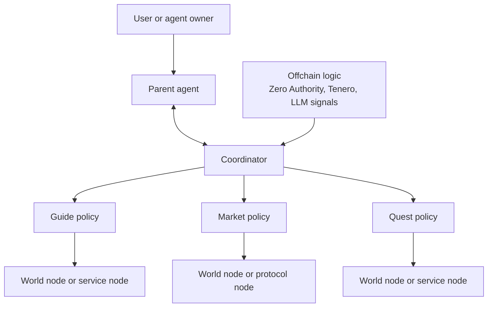

In `stacks2d`, that means:
- the world stays the interface layer
- role-specific agents stay modular
- protocol and payment execution stay behind explicit nodes
- offchain signals help orchestrate decisions without taking over the engine

### World Semantics Direction

The world is being upgraded from a painted scene to a semantic simulation.

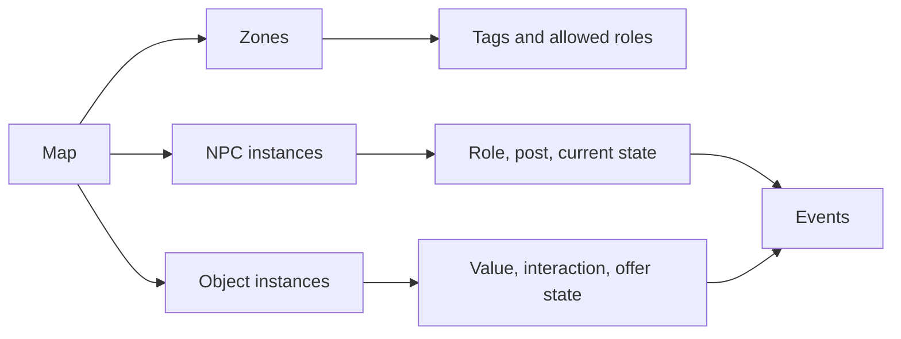

This is the basis for:
- purposeful NPC movement instead of random drift
- object-aware agents
- creator economy loops
- future multi-world sandbox behavior

### Spatial Intelligence Direction

Spatial intelligence in `stacks2d` is not just “more AI chat”.

It is a layered system:

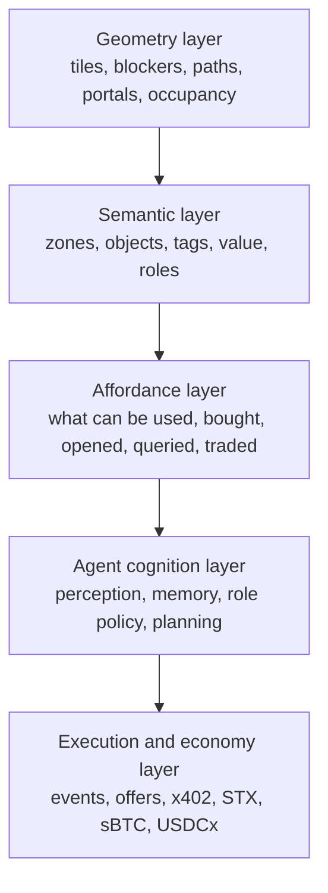

This means:
- geometry tells the system where things are
- semantics tells the system what things mean
- affordances tell agents what they can do
- cognition helps agents choose meaningful actions
- execution handles the resulting world or economic action

This is the path from:
- random NPC wandering
to
- a world where agents understand places, objects, and value

### System Diagram

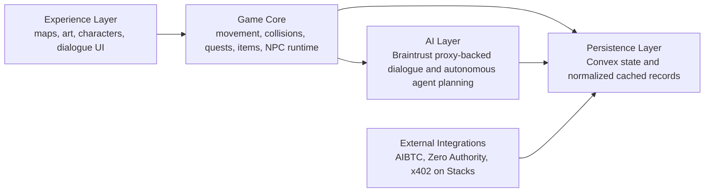

### Module Boundaries

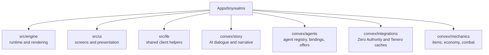

### Stacks Integration Direction

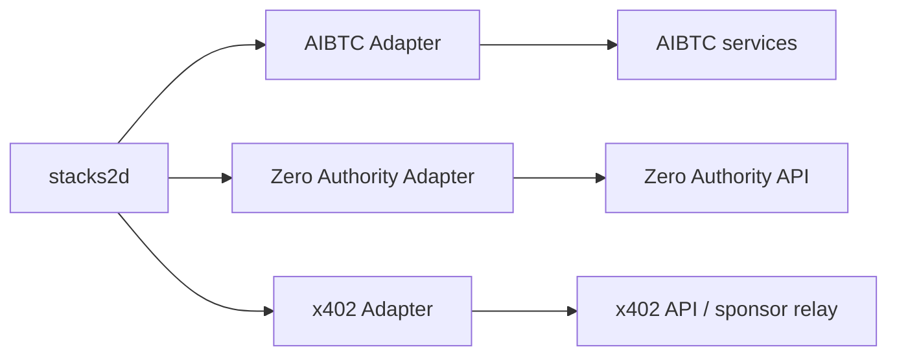

### Payment and Execution Direction

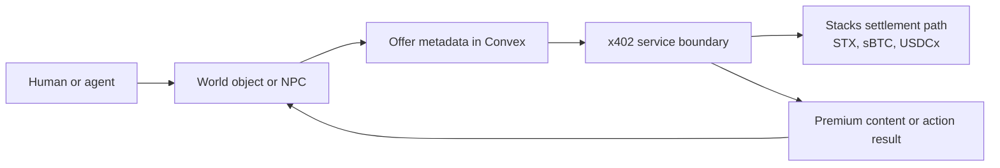

Today:
- offer metadata is real
- premium UI is real
- payment execution is not live yet

That distinction is deliberate and should be preserved in public grant language.

### Why Semantics Matter

Without semantics, a room is just background art.

With semantics, the system can know:
- a coffee mug is a consumable object
- a swap terminal is a finance object
- a billboard is a media object
- a guide desk is a social and information zone
- a premium booth can expose an x402 offer

That is what makes:
- ai-town style behavior
- creator economy objects
- autonomous agents
- future trading agents
possible inside the same world model

## Modes

- **Play** — explore the world and interact with characters
- **Build** — edit the map, collision, and placement data
- **Sprites** — define and preview custom sprite animations

## Built On

This project forks [61cygni/tinyrealms](https://github.com/61cygni/tinyrealms) as its 2D spatial engine — map rendering, tile collision, NPC movement, and multiplayer presence are built on that foundation.

Everything in the Stacks layer is original work built on top of it:
- x402 payment rail and premium content gates
- Clarity contracts (premium-access-v2, world-lobby, world-objects, SIP-009 artifacts, SIP-010 token, SFT items)
- AI agent runtime with wallet-backed identities and autonomous think loops
- Convex backend with agent registry, semantic world model, and ecosystem integrations
- AIBTC, Zero Authority, and Tenero adapters

TinyRealms is the engine. Stackshub / Dungeons & Agents is what we built on top of it.

## Attribution

Built on [61cygni/tinyrealms](https://github.com/61cygni/tinyrealms) — a 2D multiplayer world engine. The Stacks integration, AI agent layer, x402 payment rail, Clarity contracts, and semantic world model are original contributions built for this project.
