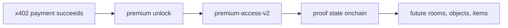

# Clarity Contract Plan

This note records the current contract sequencing decision for `stacks2d`.

## Plain-English Logic

The contract layer exists because x402 alone is not enough.

- x402 proves that a payment happened and delivers premium content
- the contract layer proves or records premium unlock state onchain

So the logic is:

This means the contract is not replacing x402.
It is extending it with durable world-readable proof.

## Plain-English Cheat Sheet

If the contract layer feels abstract, use this:

- `premium-access-v2`
  - did this wallet unlock this premium thing?

- `world-lobby`
  - can this wallet enter this room?

- `world-objects`
  - can this wallet use this object?

- `SIP-009`
  - does this wallet own this unique artifact?

- future `SFT`
  - how many repeatable game items/resources does this wallet have?

For a shorter explanation, use [Contract-Cheat-Sheet.md](/home/rv404/RV404-Lab/PRODUCTIVITY/Obsidian/Test-1a/Apps/tinyrealms/docs/Contract-Cheat-Sheet.md).

## Current Decision

The project should not lead with a world/lobby contract as the first and only contract in the payment-proof layer.

The recommended order is:

1. `premium-access-v2`
2. `world-lobby.clar`
3. `world-objects.clar`

## Current Testnet Deployments

These contracts are now deployed on Stacks testnet from this repo:

| Contract | Contract ID | Transaction |
|---|---|---|
| `premium-access-v2` | `ST2JDN3QED16X524SE8GWQSTP2MW6D2005AEEGJ9S.premium-access-v2` | [`0x96afaf46c0e1ed8f86aceb0b0687fa6bdd284f9ea1366cd5437dc25901e969c3`](https://explorer.hiro.so/txid/0x96afaf46c0e1ed8f86aceb0b0687fa6bdd284f9ea1366cd5437dc25901e969c3?chain=testnet) |
| `world-lobby` | `ST2JDN3QED16X524SE8GWQSTP2MW6D2005AEEGJ9S.world-lobby` | [`0xe411bff9d554b55f12a19c30fa4d278525f8c197f4deac3391cb4362b0e6d84f`](https://explorer.hiro.so/txid/e411bff9d554b55f12a19c30fa4d278525f8c197f4deac3391cb4362b0e6d84f?chain=testnet) |
| `world-objects` | `ST2JDN3QED16X524SE8GWQSTP2MW6D2005AEEGJ9S.world-objects` | [`0x37518e87cdb28578cdc9c8afcd5ba42245fca3c45d2adda4b4dfbd0bea5d385f`](https://explorer.hiro.so/txid/37518e87cdb28578cdc9c8afcd5ba42245fca3c45d2adda4b4dfbd0bea5d385f?chain=testnet) |

## Why `premium-access-v2` Comes First

This contract maps directly to the current product slice:
- `guide.btc` premium content
- x402 payment boundary
- paid unlock proof
- direct Stacks transaction relevance

It is the strongest first onchain proof because it ties to:
- premium content
- transactions
- receipts or unlock state

Current truth:
- this first contract is now deployed on Stacks testnet
- it was deployed from this repo using Clarity 4

## What `premium-access-v2` Actually Does

`premium-access-v2` is a narrow access-proof contract.

It lets the contract owner:

- grant access to a specific resource for a specific principal
- revoke that access
- check whether that principal currently has access
- read the stored grant record

Its storage model is:

- key:
  - `resource-id`
  - `who`
- value:
  - `granted-at`
  - `granted-by`

For the MVP, the intended first resource is:

- `guide-btc-premium-brief`

So the practical product logic is:

- x402 handles payment and delivery
- `premium-access-v2` records the durable onchain proof that the unlock happened

This contract does **not**:

- enforce payment itself
- replace x402 settlement
- mint SFT items
- manage room membership or world objects

That is why it comes before:

- `world-lobby.clar`
- `world-objects.clar`
- `sft-items.clar`

## Why a World/Lobby Contract Still Fits

The reviewed `btchub-lobby.clar` pattern is useful, but it fits better as a world/session contract than as the first payment-proof contract.

Good uses in `stacks2d`:
- `Cozy Cabin` world instance
- future `Station` world instance
- premium rooms
- sponsored scenes
- event rooms
- agent gathering spaces

What it models well:
- owner/host
- members
- world or room lifecycle
- flow-state transitions
- open / active / closed state

For the current TinyRealms sandbox, the smallest honest mapping is:

- `entry`
  - public arrival space
- `guide-desk`
  - public information zone
- `merchant-corner`
  - public trade zone
- `market-station`
  - public analytics zone now, premium or gated later
- `quest-board`
  - public opportunity zone now, gated event board later

So `world-lobby.clar` should stay focused on:

- room or zone keys
- access mode
- open / closed state
- room membership

## Recommended Mapping

- `world-lobby.clar`
  - one contract per world or world-instance pattern
  - examples:
    - `cozy-cabin`
    - `station`
    - later premium or sponsored worlds

- `premium-access-v2`
  - one narrow contract for premium unlock proof
  - tied to:
    - `guide.btc`
    - later premium reports, rooms, scenes, or services

- `world-objects.clar`
  - one thin object access registry
  - plain English: a door-lock list for important props
  - tied to current semantic objects such as:
    - `guide-post`
    - `merchant-post`
    - `market-post`
    - `quest-post`
    - `price-board`
    - `opportunity-board`
  - later extends cleanly to:
    - music terminals
    - vinyl or cassette displays
    - premium media consoles
    - event props and collectible surfaces

- `floppy-disk-nft.clar`
  - narrow SIP-009 artifact contract for the floppy item
  - intended as a low-tier collectible media relic
  - minimal mint, transfer, owner lookup, and token URI surface

- `cassette-nft.clar`
  - narrow SIP-009 artifact contract for the cassette item
  - intended as a mid-tier collectible media relic
  - minimal mint, transfer, owner lookup, and token URI surface

- `wax-cylinder-nft.clar`
  - narrow SIP-009 artifact contract for the wax cylinder item
  - intended as the flagship collectible music artifact
  - minimal mint, transfer, owner lookup, and token URI surface
  - richer metadata can be layered later if the artifact loop proves out

- future `sft-items.clar`
  - resources, items, crafting, upgrades, passes
  - aligned with Stacks GameFi SFT patterns
  - best added after world/session and object layers are established

## NFT Transfer Guardrails

For these SIP-009 artifact contracts:

- keep the first pass to mint, owner lookup, token URI, and explicit transfer
- if player-facing transfers are added, use wallet post-conditions in deny mode
- if optional NFT movement becomes part of zone entry or equip flows later, adopt the SIP-040 `may-send` pattern once it is live on Stacks
- if autonomous agents later transfer player-held assets, wrap those flows with explicit asset restrictions rather than broad allowances

## Important Truth

The lobby/world contract is a good fit for the long-term world model.

It is **not** a substitute for:
- payment proof
- premium access proof
- x402-linked transaction evidence

## Next Contract Work

1. Keep x402 success scoped to `premium-access-v2` as post-payment proof/state, not settlement itself
2. Verify and capture txids for the current premium surfaces using resource-specific access keys such as `guide-btc-premium-brief`
3. Add app-level reads and writes for `world-lobby.clar` room access
4. Add app-level reads and writes for `world-objects.clar` object registration and access
5. Add the three artifact NFT contracts to the deployment plan:
   `floppy-disk-nft.clar`, `cassette-nft.clar`, `wax-cylinder-nft.clar`
6. Mint or claim those artifacts only after the related world loops are stable
7. Later, add an SFT item/resource layer for GameFi progression and repeatable items
