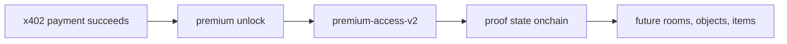

# Clarity Contract Plan

This note records the current contract sequencing decision for `stacks2d`.

## Plain-English Logic

The contract layer exists because x402 alone is not enough.

- x402 proves that a payment happened and delivers premium content
- the contract layer proves or records premium unlock state onchain

So the logic is:

This means the contract is not replacing x402.
It is extending it with durable world-readable proof.

## Current Decision

The project should not lead with a world/lobby contract as the first and only hackathon contract.

The recommended order is:

1. `premium-access-v2`
2. `world-lobby.clar`

## Why `premium-access-v2` Comes First

This contract maps directly to the current product slice:
- `guide.btc` premium content
- x402 payment boundary
- paid unlock proof
- judge-visible Stacks transaction relevance

It is the strongest first onchain proof because it ties to:
- premium content
- transactions
- receipts or unlock state

Current truth:
- this first contract is now deployed on Stacks testnet
- it was deployed from this repo using Clarity 4

## What `premium-access-v2` Actually Does

`premium-access-v2` is a narrow access-proof contract.

It lets the contract owner:

- grant access to a specific resource for a specific principal
- revoke that access
- check whether that principal currently has access
- read the stored grant record

Its storage model is:

- key:
  - `resource-id`
  - `who`
- value:
  - `granted-at`
  - `granted-by`

For the MVP, the intended first resource is:

- `guide-btc-premium-brief`

So the practical product logic is:

- x402 handles payment and delivery
- `premium-access-v2` records the durable onchain proof that the unlock happened

This contract does **not**:

- enforce payment itself
- replace x402 settlement
- mint SFT items
- manage room membership or world objects

That is why it comes before:

- `world-lobby.clar`
- `world-objects.clar`
- `sft-items.clar`

## Why a World/Lobby Contract Still Fits

The reviewed `btchub-lobby.clar` pattern is useful, but it fits better as a world/session contract than as the first payment-proof contract.

Good uses in `stacks2d`:
- `Cozy Cabin` world instance
- future `Station` world instance
- premium rooms
- sponsored scenes
- event rooms
- agent gathering spaces

What it models well:
- owner/host
- members
- world or room lifecycle
- flow-state transitions
- open / active / closed state

## Recommended Mapping

- `world-lobby.clar`
  - one contract per world or world-instance pattern
  - examples:
    - `cozy-cabin`
    - `station`
    - later premium or sponsored worlds

- `premium-access-v2`
  - one narrow contract for premium unlock proof
  - tied to:
    - `guide.btc`
    - later premium reports, rooms, scenes, or services

- future `sft-items.clar`
  - resources, items, crafting, upgrades, passes
  - aligned with Stacks GameFi SFT patterns
  - best added after world/session and object layers are established

## Important Truth

The lobby/world contract is a good fit for the long-term world model.

It is **not** a substitute for:
- payment proof
- premium access proof
- x402-linked transaction evidence

## Next Contract Work

1. Wire x402 success to `premium-access-v2`
2. Keep it scoped as post-payment proof/state, not x402 settlement itself
3. Use resource-specific access keys such as `guide-btc-premium-brief`
4. After that, adapt the `btchub-lobby.clar` state-machine style into `world-lobby.clar`
5. Later, add an SFT item/resource layer for GameFi progression and passes
