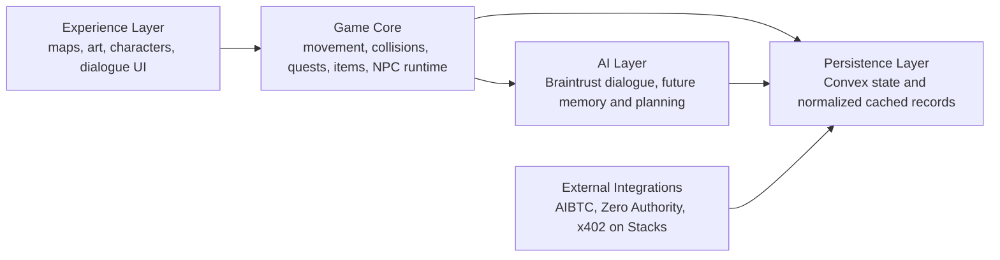
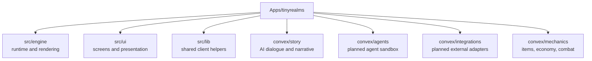
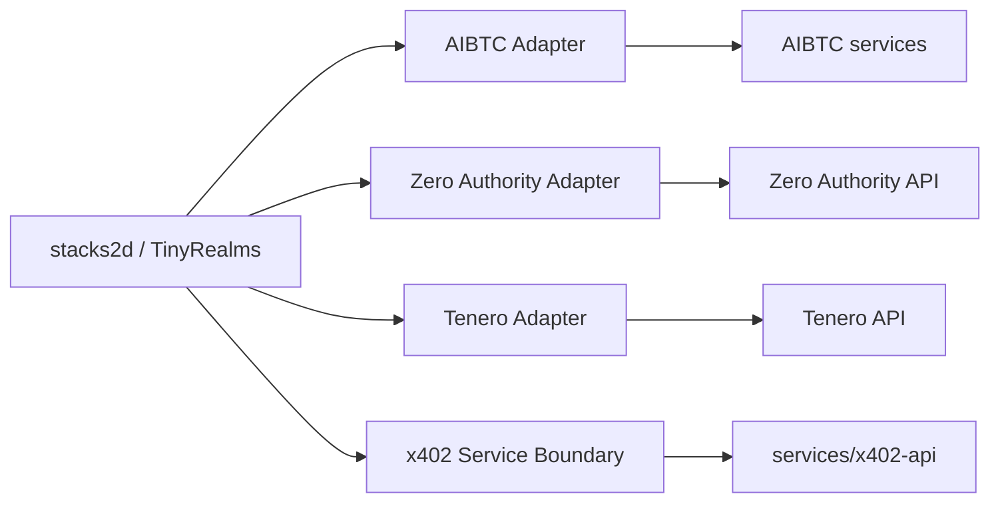
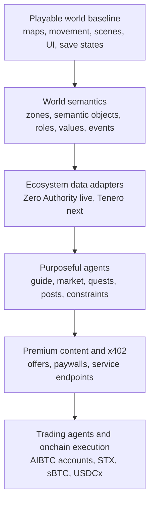
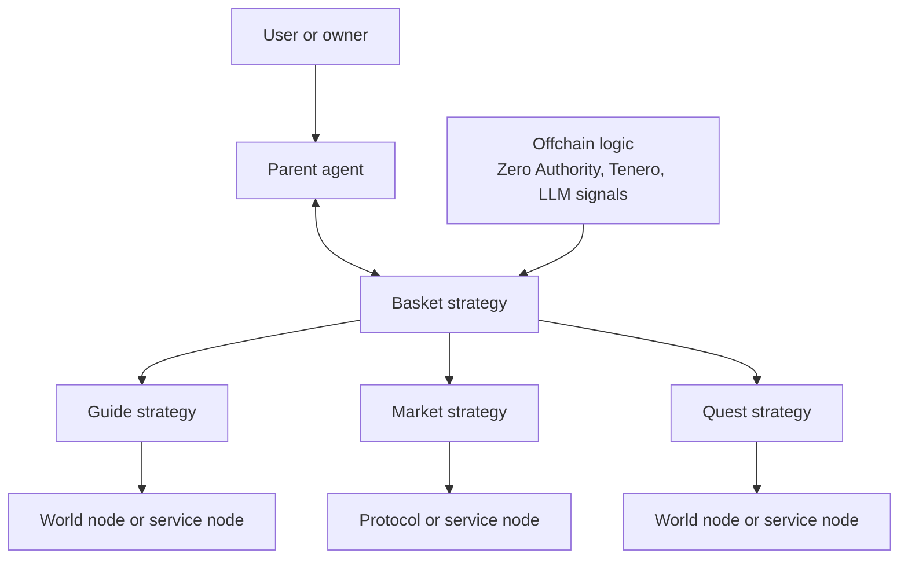
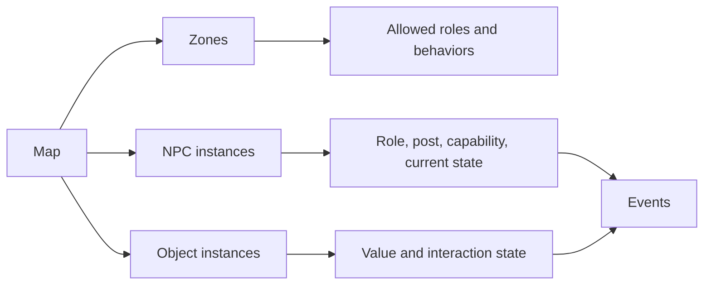
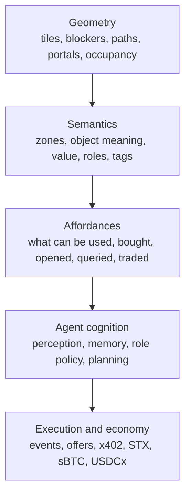
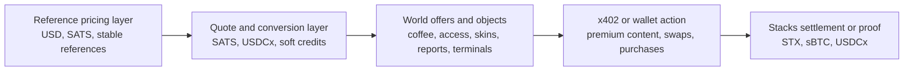

# Stacks2D Architecture

This document explains the current module boundaries for `stacks2d (tinyrealms)` and the planned path toward AIBTC- and x402-aligned integrations on Stacks.

## Product Framing

`stacks2d (tinyrealms)` is a work-in-progress 2D social world and agent sandbox.

The current codebase already supports:
- world rendering
- map editing
- sprite definitions
- multiplayer presence foundations
- NPC runtime state
- Braintrust-backed AI actions

The future direction adds:
- richer agent logic
- external ecosystem ingestion
- x402 on Stacks transaction flows
- AIBTC-aligned agent tooling

## Core Boundary

## Current Truth

Live now:
- TinyRealms world runtime
- local and cloud-ready Convex backend patterns
- Braintrust-backed AI path
- Zero Authority backend ingestion and cache
- Tenero-backed live market ticker in the HUD
- dedicated in-world surfaces for:
  - `guide.btc`
  - `market.btc`
  - `quests.btc`
- World Feed driven by typed `worldEvents`

Scaffolded now:
- `guide.btc` premium content path
- x402 offer metadata
- separate `services/x402-api` boundary for premium endpoints
- agent-state storage
- AIBTC-compatible agent registry and planned account binding

Planned next:
- ranked and fresher ecosystem snapshots
- purposeful agent behaviors tied to roles and zones
- real x402 payment execution
- real AIBTC-compatible agent runtime and account flows

## Folder Mapping

## External Service Position

## Sequential Implementation Order

This is the intended build order. Each layer depends on the previous one.

Why this order matters:
- it protects the creative layer from payment and wallet complexity
- it prevents frontend code from becoming an API integration dump
- it keeps public claims aligned with verified functionality

## Multi-Agent Execution Model

The long-term agentic model is hierarchical, not a single giant NPC brain.

This allows:
- one user or owner-facing agent session
- orchestration across multiple worker strategies
- clear separation between planning and execution
- future protocol-specific trading or yield agents without coupling them to the renderer

## World Semantics Model

To support purposeful agents and many future worlds, the simulation needs a semantic layer.

Examples:
- a `guide` role belongs near a `guide-desk` zone
- a `market` role belongs near a `price-board` or `swap-terminal`
- a `quest` role belongs near a `board` or `rumor desk`

This is what closes the gap between:
- what a player visually sees in a room
- what the system understands about the room

## Spatial Intelligence Stack

The project should treat spatial intelligence as a stack, not a single AI feature.

This architecture matters because:
- more LLM output alone will not create a believable simulation
- agents need structured knowledge of places, objects, and value
- deterministic movement and pathing should remain separate from high-level reasoning

Practical interpretation:
- geometry answers where things are
- semantics answers what things are
- affordances answer what can be done
- cognition answers what should happen next
- execution carries out the chosen action

## Why This Is Needed

The current world already contains rich visual scenes, but many visible objects still exist only as art, not as system-readable entities.

Examples:
- books
- coffee
- swords
- knives
- media surfaces
- terminals

To support a true agent sandbox, these need to become:
- semantic objects
- value surfaces
- interaction points
- optional offer or premium nodes

## Economy and Settlement Model

The economy is hybrid by design.

Design rules:
- fast-changing world state stays offchain in Convex
- sensitive payment, ownership, and settlement paths move onchain only when needed
- do not claim a hard peg for in-world currency unless it is actually redeemable and enforced

## Judge-Facing Summary

The strongest accurate description today is:

- a playable 2D Stacks-facing world
- with real backend ecosystem ingestion from Zero Authority and Tenero
- with real in-world surfaces for guide, market, and opportunity discovery
- with a real AI guide path
- with modular scaffolding for premium content, x402, and future AIBTC-style agents

The strongest next milestone is:

1. make the x402 service boundary executable on testnet
2. add one narrow Clarity proof contract
3. continue moving NPC behavior from static roles to semantic actions

## Practical Rule

Do not merge external infrastructure into the game runtime.

Keep separate:
- game and experience
- agent logic
- external integrations
- payment infrastructure

That allows:
- faster asset and level iteration
- lower technical debt
- cleaner grant positioning
- safer future wallet work

## Stacks and AIBTC Positioning

This project should be described as:

- a work-in-progress TinyRealms fork
- building toward a 2D sandbox for AI agents and creator economy
- aligned with AIBTC patterns for agent tooling
- exploring x402 on Stacks for paid service and transaction flows

It should not be described as fully integrated with all of those systems yet.
