# Stacks2D Architecture

This document explains the current module boundaries for `stacks2d (tinyrealms)` and the planned path toward AIBTC- and x402-aligned integrations on Stacks.

## Product Framing

`stacks2d (tinyrealms)` is a work-in-progress 2D social world and agent sandbox.

It builds from the original TinyRealms foundation, but the active product direction is a semantic Stacks-facing sandbox for agents, creator economy, and paid service surfaces.

The current codebase already supports:
- world rendering
- map editing
- sprite definitions
- multiplayer presence foundations
- NPC runtime state
- Braintrust-backed AI actions

The future direction adds:
- richer agent logic
- external ecosystem ingestion
- stronger in-world agent dialogue and worldFacts coordination
- x402-to-contract writes
- fuller AIBTC-aligned agent runtime
- Clarity 4 proof and world-state contracts

## Core Boundary

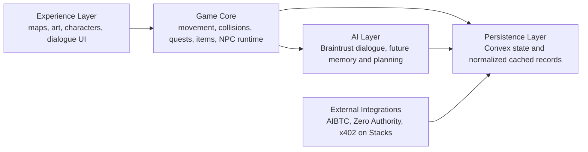

## Current Truth

Live now:
- TinyRealms world runtime
- local and cloud-ready Convex backend patterns
- Braintrust-backed AI path
- Zero Authority backend ingestion and cache
- Tenero-backed live market ticker in the HUD
- dedicated in-world surfaces for:
  - `guide.btc`
  - `market.btc`
  - `quests.btc`
- World Feed driven by typed `worldEvents`

Scaffolded now:
- separate `services/x402-api` boundary for premium endpoints
- agent-state storage and account-binding tables
- worldFacts blackboard pattern for lightweight coordination
- external AIBTC module boundary, not yet full in-world runtime

Verified now:
- local x402 payment path for `guide.btc`
- local x402 paid quote path for `market.btc`
- saved `npcProfiles`-backed in-world dialogue for `market.btc`
- deployed `premium-access-v2`, `world-lobby`, and `world-objects` contracts on Stacks testnet
- working Clarity 4 deploy path from this repo

Planned next:
- ranked and fresher ecosystem snapshots
- purposeful agent behaviors tied to roles and zones
- lightweight gossip via `worldEvents` propagation
- x402-to-contract grant integration
- real AIBTC-compatible agent runtime and account flows

## Folder Mapping

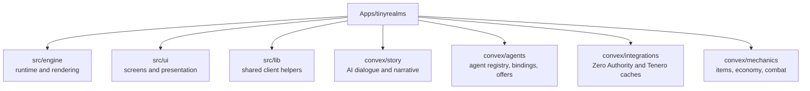

## External Service Position

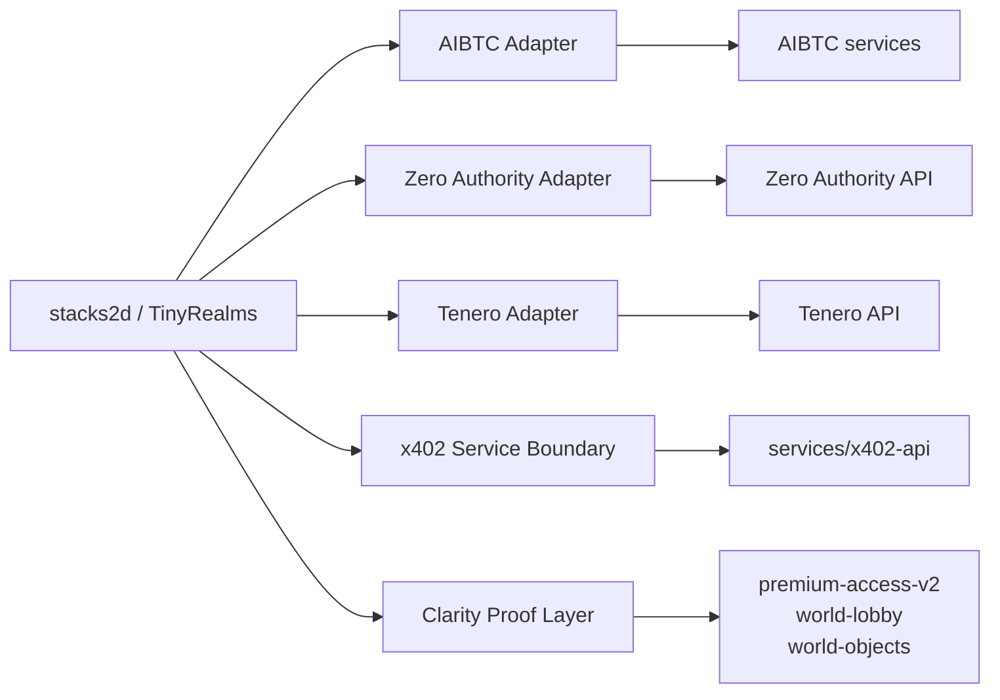

## Verified Connector Execution

The current Stacks ecosystem slice already runs through backend adapters rather than direct frontend API calls.

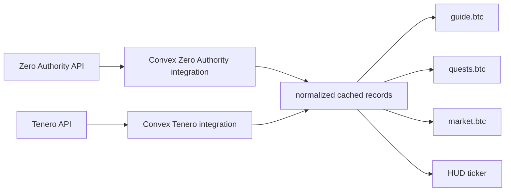

What is verified:
- Zero Authority data is cached in Convex and exposed through `guideSnapshot`
- Tenero token data is cached in Convex and exposed through `tickerRows`
- the browser consumes those backend queries instead of calling the external APIs directly

This proves real backend connector execution, not just themed UI.

## Lightweight Gossip Layer

For the hackathon scope, `gossip` should be understood as app-level event propagation, not a separate protocol.

The current foundation already exists:
- typed `worldEvents`
- agent and NPC surfaces
- Convex as the live coordination layer

The intended behavior is:
- important actions write a world event
- nearby or role-relevant agents observe a subset of those events
- dialogue, premium surfaces, and world memory reflect that propagated state

This is especially relevant for:
- x402 premium unlocks
- market offers purchased
- new opportunities surfacing
- agent status changes

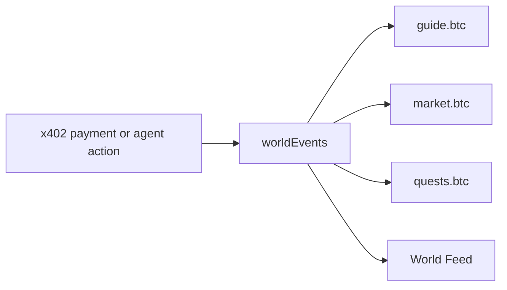

This gives the world social consequences without requiring every agent to poll all backend state directly.

## Sequential Implementation Order

This is the intended build order. Each layer depends on the previous one.

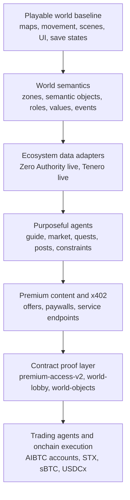

Why this order matters:
- it protects the creative layer from payment and wallet complexity
- it prevents frontend code from becoming an API integration dump
- it keeps public claims aligned with verified functionality

## Multi-Agent Execution Model

The long-term agentic model is hierarchical, not a single giant NPC brain.

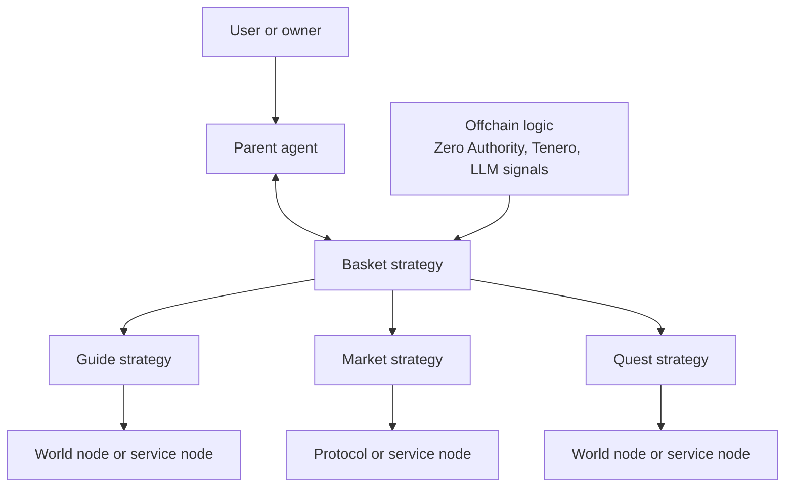

This allows:
- one user or owner-facing agent session
- orchestration across multiple worker strategies
- clear separation between planning and execution
- future protocol-specific trading or yield agents without coupling them to the renderer

## World Semantics Model

To support purposeful agents and many future worlds, the simulation needs a semantic layer.

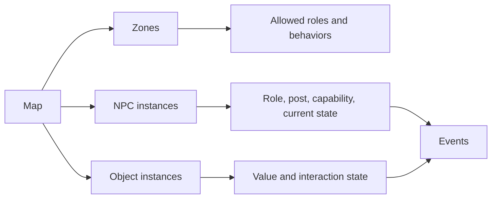

Examples:
- a `guide` role belongs near a `guide-desk` zone
- a `market` role belongs near a `price-board` or `swap-terminal`
- a `quest` role belongs near a `board` or `rumor desk`

This is what closes the gap between:
- what a player visually sees in a room
- what the system understands about the room

## Spatial Intelligence Stack

The project should treat spatial intelligence as a stack, not a single AI feature.

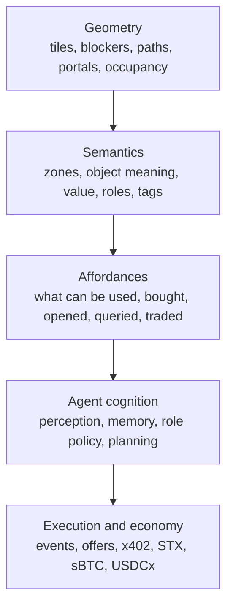

This architecture matters because:
- more LLM output alone will not create a believable simulation
- agents need structured knowledge of places, objects, and value
- deterministic movement and pathing should remain separate from high-level reasoning

Practical interpretation:
- geometry answers where things are
- semantics answers what things are
- affordances answer what can be done
- cognition answers what should happen next
- execution carries out the chosen action

## Current Clarity Proof Layer

The first onchain proof layer is now live on testnet:

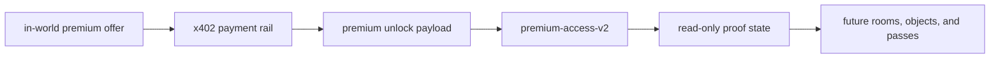

Current truth:
- `premium-access-v2` is deployed on Stacks testnet
- it is a post-payment proof/state contract
- the app does not yet call `grant-access` automatically after successful x402 settlement

Plain-English interpretation:
- x402 answers: "was this premium action paid for?"
- `premium-access-v2` answers: "does this principal now have onchain premium access proof?"

## Why This Is Needed

The current world already contains rich visual scenes, but many visible objects still exist only as art, not as system-readable entities.

Examples:
- books
- coffee
- swords
- knives
- media surfaces
- terminals

To support a true agent sandbox, these need to become:
- semantic objects
- value surfaces
- interaction points
- optional offer or premium nodes

## Economy and Settlement Model

The economy is hybrid by design.

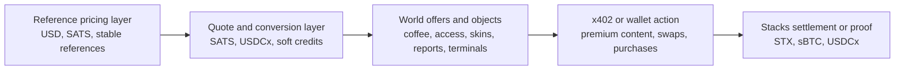

Design rules:
- fast-changing world state stays offchain in Convex
- sensitive payment, ownership, and settlement paths move onchain only when needed
- do not claim a hard peg for in-world currency unless it is actually redeemable and enforced

## Future GameFi / SFT Layer

The planned GameFi layer is strongly informed by the Stacks GameFi SFT tutorial covering resource burn/mint flows, acquisition, crafting, level-up, and token URI metadata. Source: [SFTs: Flow and Smart Contracts](https://gamefi-stacks.gitbook.io/stacks-degens-gaming-universe/sfts-flow-and-smart-contracts)

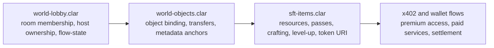

This layer would support:
- world passes and access badges
- consumable resources
- craftable items
- upgradeable tools and modules
- creator/media access items

Important truth:
- this SFT/GameFi layer is part of the architecture roadmap
- it is not yet implemented in the current repo

## Judge-Facing Summary

The strongest accurate description today is:

- a playable 2D Stacks-facing world
- with real backend ecosystem ingestion from Zero Authority and Tenero
- with real in-world surfaces for guide, market, and opportunity discovery
- with a real AI guide path
- with modular scaffolding for premium content, x402, and future AIBTC-style agents

The strongest next milestone is:

1. make the x402 service boundary executable on testnet
2. add one narrow Clarity proof contract
3. continue moving NPC behavior from static roles to semantic actions

## Practical Rule

Do not merge external infrastructure into the game runtime.

Keep separate:
- game and experience
- agent logic
- external integrations
- payment infrastructure

That allows:
- faster asset and level iteration
- lower technical debt
- cleaner grant positioning
- safer future wallet work

## Stacks and AIBTC Positioning

This project should be described as:

- a Stacks-facing world built from the TinyRealms foundation
- building toward a 2D sandbox for AI agents and creator economy
- aligned with AIBTC patterns for agent tooling
- exploring x402 on Stacks for paid service and transaction flows

It should not be described as fully integrated with all of those systems yet.
