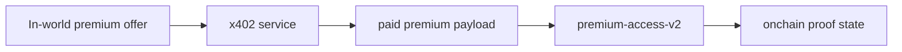

# X402 Service Boundary

This document explains what the x402 layer is doing in `tinyrealms`, why it exists as a separate service, and how it relates to the Clarity contract layer.

## Current Truth

- Premium offer metadata exists in Convex.
- The world UI can display premium offer details.
- The repo contains a separate x402 service at `services/x402-api`.
- The service is wired to attempt `premium-access-v2.grant-access(...)` after successful premium settlement.
- The premium response is returned as structured JSON.
- The hosted/public facilitator path is still not verified.
- The deployed contract layer exists separately as:
  - `ST2JDN3QED16X524SE8GWQSTP2MW6D2005AEEGJ9S.premium-access-v2`

## Why x402 Exists

x402 is the payment rail.

Its job is:
- return `402 Payment Required`
- accept a signed payment retry
- settle the payment
- return premium content

It is **not** the world-state or onchain-proof layer.

## Why a Separate Service

Payment logic should not live inside:
- Pixi rendering
- HUD code
- NPC movement
- map logic
- random frontend state

The world should expose semantic offers.
The x402 service should enforce payment-required access to those offers.

## Why the Contract Also Exists

The Clarity contract does a different job from x402.

`premium-access-v2` exists to record or prove premium unlock state onchain after payment.

That means:
- x402 = payment and premium delivery
- Clarity = durable proof / unlock state

`premium-access-v2` is not a payment contract.

It exists to answer:

- did this wallet unlock this premium resource?
- when was that access granted?
- who granted it?

Current intended use cases:

- `guide-btc-premium-brief`
- future premium reports
- future premium rooms via `world-lobby.clar`
- future premium objects and terminals via `world-objects.clar`
- later passes, keys, and itemized access via `sft-items.clar`

This is the intended relationship:

Why this separation is useful:
- the payment rail stays simple
- the proof layer stays explicit
- future rooms, objects, and items can reuse the same contract logic

## Initial Asset Rail

- `STX` on `testnet`

This is the narrowest credible first payment path.

## Active Endpoint

- `GET /api/premium/guide-btc`
- `GET /api/premium/guide-btc/bookshelf-brief`
- `GET /api/premium/market-btc/quote`
- `GET /api/premium/mel/signal`
- `GET /api/premium/mel/wax-cylinder-memory`

Supporting metadata endpoints exist for the world-triggered premium surfaces where the UI needs preview information.

## Expected Flow

1. `guide.btc` exposes a premium offer in-world.
2. The offer metadata references `/api/premium/guide-btc`.
3. The x402 service returns an HTTP `402 Payment Required`.
4. A wallet client signs and retries.
5. The service settles the payment and returns premium JSON payload.
6. The service attempts `premium-access-v2.grant-access(...)` and logs a matching world event.
7. The app can render the premium result, txid, and resulting world state.

## Why the Premium Payload Is JSON

The premium response is intentionally JSON-first.

That is important because:
- humans can view it as a styled premium card
- agents can consume it directly
- the same interface can later support:
  - premium rooms
  - premium terminals
  - premium reports
  - pass/item unlocks

## What Is Not Claimed Yet

- No verified hosted/public facilitator path yet
- No fully captured live proof set for every premium surface yet
- No fully enriched classified briefing payload yet
- No live AIBTC execution path yet

## Next Steps

1. Capture and log real `grant-access` txids for the live premium surfaces
2. Add richer backend-sourced premium briefing fields to the JSON payload
3. Reflect successful unlocks in `worldEvents` / `worldFacts`
4. Extend the same pattern later to:
   - `world-lobby.clar`
   - `world-objects.clar`
   - `wax-cylinder-nft.clar`
   - `sft-items.clar`
