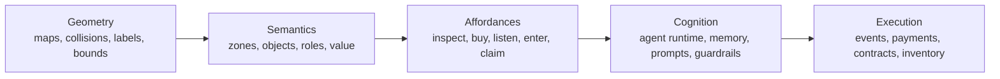

# Spatial Intelligence Direction

Purpose: define how `tinyrealms` should evolve from a map with NPC movement into a world where agents understand places, objects, and value.

Audience:
- builders working on agents, worlds, or interactables
- reviewers evaluating the simulation direction

Last verified: 2026-03-17

## Core Direction

Spatial intelligence in `tinyrealms` is not "more AI chat."

It is a layered system:

1. `geometry`
2. `semantics`
3. `affordances`
4. `cognition`
5. `execution`

This means:

- geometry tells the system where things are
- semantics tells the system what things mean
- affordances tell agents what they can do
- cognition helps agents choose meaningful actions
- execution handles the resulting world or economic action

This is the path from:

- random NPC wandering

to:

- a world where agents understand places, objects, and value

## Layered Model

### 1. Geometry

Geometry is the physical layer.

It includes:

- tilemaps
- collision masks
- labels
- world coordinates
- zone bounds
- pathing constraints

In `tinyrealms`, this lives primarily in:

- `public/assets/maps/*`
- `maps`
- `mapObjects`
- movement/collision handling in `src/engine/*`

### 2. Semantics

Semantics is the meaning layer.

It tells the system:

- what a room is for
- what an object represents
- which role belongs where
- which places are social, economic, educational, or premium

In `tinyrealms`, this maps to:

- `worldZones`
- `semanticObjects`
- `npcRoleAssignments`
- `worldFacts`

### 3. Affordances

Affordances are the action layer.

They describe what can be done with a place or object.

Examples:

- inspect
- talk
- buy
- unlock
- listen
- enter
- pay
- claim

In `tinyrealms`, affordances are currently carried through:

- `semanticObjects.affordances`
- interactable metadata
- premium offer bindings
- world-triggered prompts in the runtime

### 4. Cognition

Cognition is the decision layer.

It should not replace geometry or semantics.
It should consume them.

Agent cognition should use:

- recent world events
- role prompts
- home zone / post information
- object affordances
- bounded memory
- model guardrails

In `tinyrealms`, this maps to:

- `agentStates`
- `agentRegistry`
- `convex/agents/runtime.ts`
- `convex/story/storyAi.ts`

### 5. Execution

Execution is the consequence layer.

This is where decisions become:

- world events
- state changes
- premium unlocks
- wallet actions
- contract proof

In `tinyrealms`, execution should remain split across:

- Convex mutations for world truth
- `services/x402-api` for payments
- Clarity contracts for durable proof and artifact ownership

## System Diagram

## Module Boundaries

The system stays clean only if each layer has a clear owner.

| Layer | Primary owner | Examples |
| --- | --- | --- |
| geometry | engine + map assets | maps, collision, labels, spawn points |
| semantics | Convex world/interactables domain | `worldZones`, `semanticObjects`, `npcRoleAssignments` |
| affordances | runtime + interactable definitions | prompts, actions, premium bindings, object affordances |
| cognition | agent runtime + story AI | epochs, dialogue generation, world-event reactions |
| execution | Convex + x402 + contracts | `worldEvents`, `worldFacts`, `premium-access-v2`, SIP-009 artifacts |

Practical rule:

- engine should not invent semantic meaning
- AI should not be responsible for raw collision or room topology
- payments should not live inside rendering code
- contracts should not carry high-frequency world simulation

## Stacks Integration Direction

Stacks belongs at the execution and proof layer, not the geometry layer.

That means:

- `STX + x402` handles premium action payment
- `premium-access-v2` records post-payment unlock proof
- `world-lobby` and `world-objects` support room/object access state
- SIP-009 artifact contracts hold unique media collectibles
- future SIP-010 and SFT layers handle repeatable currency/resources later

This keeps the stack clean:

- world understanding stays offchain and fast
- economic proof and ownership become onchain only where it matters

## Immediate Product Meaning

For the current build, spatial intelligence should mean:

- agents stay in meaningful zones
- objects have clear affordances
- autonomous thoughts react to real world events
- premium actions are triggered by world context
- artifact ownership sits on top of world interaction, not outside it

That is enough to make the world feel intentional without pretending the engine is already a full autonomous simulation platform.
