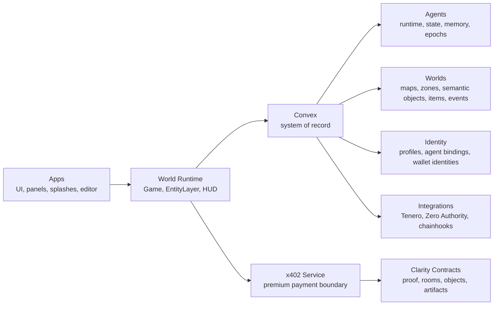
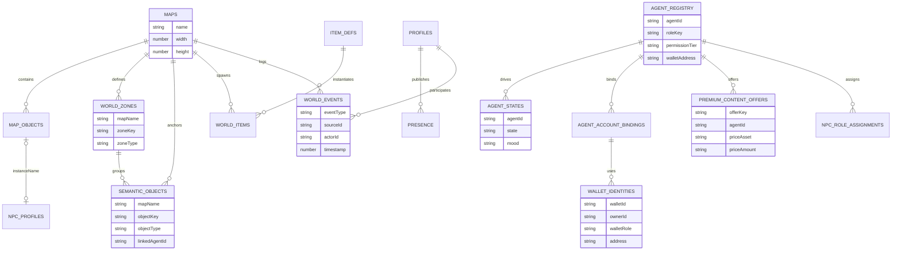
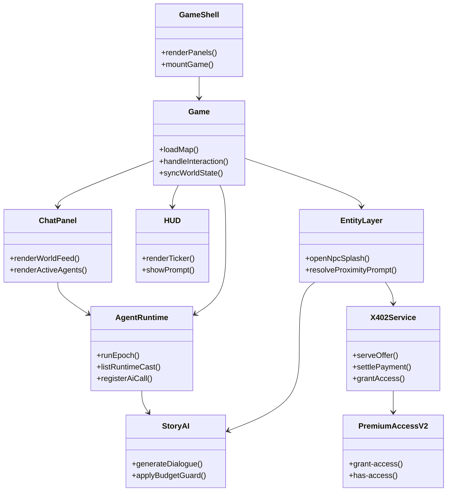
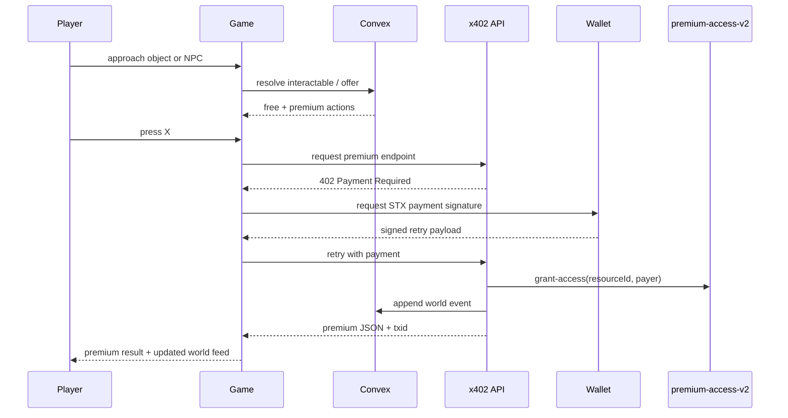
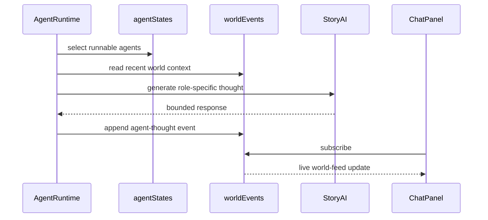
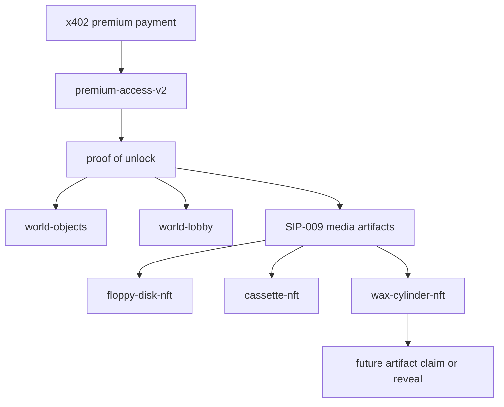

# System Diagrams

Purpose: provide one visual architecture pack for `tinyrealms`.

Audience:
- maintainers
- reviewers
- anyone trying to understand the stack quickly

Last verified: 2026-03-17

## 1. System Map

## 2. Canonical Domain ERD

This ERD is conceptual and tracks the main relationships used in the current build.

## 3. Runtime UML

## 4. Premium Interaction Sequence

## 5. Autonomous Agent Epoch Sequence

## 6. Contract Layer

